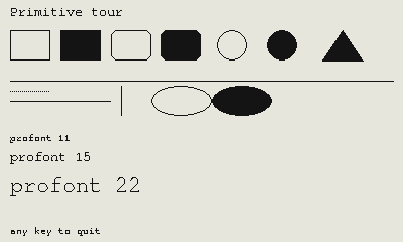
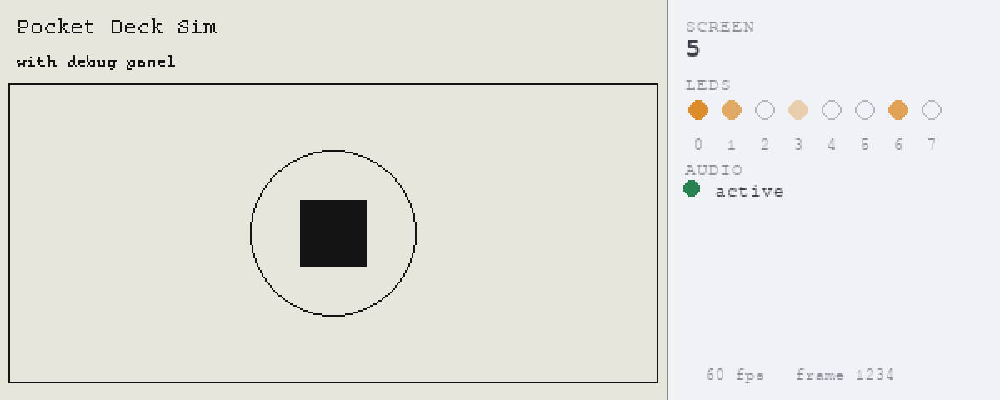

# Pocket Deck dev kit

Two independent tools for iteration on Pocket Deck apps from a Mac: Simulator "shim", and Device-Uploader "sync". Not distraction free, use the Deck for mental space.

- [**`shim/`**](shim) — a drop-in `pdeck` / `vscreen` module for desktop CPython. Develop [limited](shim/README.md#whats-not-covered) Pocket Deck apps on your Mac(\*) with a pygame window standing in for the 400×240 monochrome LCD. Sketch ideas on desktop(\*\*) for layout work and debugging. 
  - _(\*) May also work under Linux._ 
  - _(\*\*) May not be perfect, especially timing, plus drawing fonts and ovals._

| Without ... | and With the [debug panel](shim/README.md#debug-panel) (default) |
| -- | -- |
|  |  |

- **__[UNTESTED]__** [**`sync/`**](sync) — file watcher that SCPs changed `.py` files to the deck and triggers `r <module>` over SSH. Pure Bash + `fswatch`. No simulation, real device. An "edit, push, and see it run" on the deck tool. **__[UNTESTED]__**

The two are complementary. Do layout and logic in the shim, then push to the device with the sync script to play.

See each directory's README for setup.

- [shim/README.md](shim/README.md)
- **__[UNTESTED]__** [sync/README.md](sync/README.md) **__[UNTESTED]__**

# Acknowledgements

This project is _not_ endorsed by Nunomo, Inc. Pocket Deck is copyright Nunomo, Inc.

- This is an independent simulator for the public Pocket Deck python API. The official firmware and Python API live at raspy135/pocketdeck and are licensed BSD-3-Clause; this project does not include or distribute their code.

This shim targets the API declared here:

- https://github.com/raspy135/pocketdeck 

This project was generated heavily by AI:

- Claude Opus 4.7, based upon [Pocket Deck API](https://github.com/raspy135/pocketdeck) on April 20 2026
